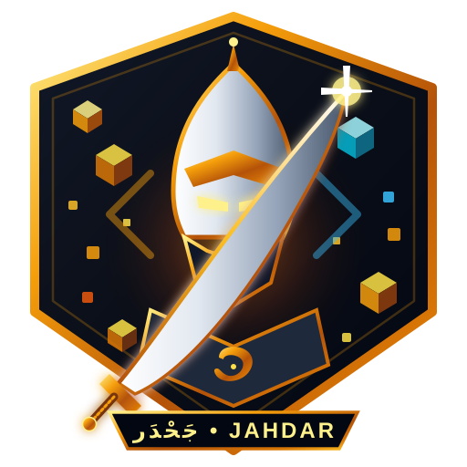

# 🗡️ جَحْدَر // JAHDAR — قاهر عمالقة الويب

<p align="center">
  
</p>

<p align="center">
  <strong>لعبة ومنصة رمل تجريبية مفتوحة المصدر لتدمير صفحات الويب فيزيائياً بنظام الفوكسل النقطي</strong><br>
  <em>An experimental open-source 2D destructible physics sandbox to demolish any webpage, built on a real-time 2px voxel collision engine.</em>
</p>

<p align="center">
  
  
  
  
  
  
</p>

---

> ### ⚠️ تنويه هام للمطورين والمجتمع / Project Notice
> **هذا المشروع هو مشروع جانبي تجريبي مفتوح المصدر (Experimental Open-Source Side Project).**
> تم بناؤه كإثبات مفهوم (Proof of Concept) لمحاكاة تدمير المواقع والصفحات التفاعلية فيزيائياً، **وهو بحاجة للكثير من التطوير، التحسين، وإعادة الهيكلة**.
> نرحب بشدة بجميع المساهمات، الأفكار، وإرسال الـ Pull Requests والـ Issues لنرتقي بالمشروع معاً!

---

## 📖 قصة الاسم والهوية (The Lore)

سُمّيت اللعبة بـ **«جَحْدَر»** استلهاماً من الفارس العربي التاريخي الشهير **جَحْدَر بن ضبيعة البكري**، الذي كان قصير القامة ضئيل الجسم، لكنه امتلك شجاعة أسطورية وبأساً شديداً، فصرع الأسد الضاري وهزم أعتى الفرسان العمالقة.

في هذه اللعبة، يلعب المستخدم بشخصية **الفارس الصغير جَحْدَر**، حاملاً عتاداً متطوراً ليقف في وجه «عمالقة الويب» (الصفحات المعقدة، النصوص الإعلانية، تصاميم الـ SaaS الضخمة)، ليُفتّت هياكلها حرفاً حرفاً وعنصراً عنصراً بقوانين فيزيائية واقعية.

---

## ✨ المميزات الحالية (Current Features)

- 🧱 **محرك فوكسل نقطي ثنائي الأبعاد (2px Real-time Voxel Grid):**
  - تدمير بولياني فوري (Boolean Subtraction) بدقة 2 بكسل.
  - تمييز الفراغات بين السطور والفقرات كفراغات هوائية يمكن للاعب القفز خلالها والمشي فوق خطوط النصوص كمنصات (Solid Platforms).
- 🔤 **تفكيك النصوص وعناصر الـ DOM التفاعلية:**
  - دعم خاص للغة العربية: الحفاظ على الكلمة المتصلة ككيان متماسك قابل للتكسير.
  - دعم الحروف اللاتينية والرموز البرمجية ككتل مستقلة.
  - استخراج الأزرار، الكروت، الحقول والصور وتحويلها لأجسام فيزيائية حقيقية.
- 🔫 **ترسانة أسلحة مدمرة (10 أسلحة فريدة):**
  1. **الرشاش التكتيكي (Assault Rifle):** إطلاق ناري سريع مستمر.
  2. **شوزن الفوضى (Chaos Shotgun):** طلقات انتشارية عنيفة للمسافات القريبة.
  3. **قاذف الصواريخ (Rocket Launcher):** قذائف صاروخية تنفجر مخلّفة فوهات دائرية.
  4. **ليزر البلازما (Plasma Beam):** شعاع صهر حراري فوري يخرق المواد.
  5. **الرامي المرتد (Cluster Grenades):** قنابل ترتد وتتفرع لشظايا حارقة.
  6. **المنشار الدوار (Rotary Saw):** مقذوفات دورانية تقطع الهياكل كشفرات.
  7. **درون الدعم القتالي (Combat Drone):** طائرة مسيّرة تدور حولك وتطلق على الركام.
  8. **مدفع الريلغان (Railgun):** مقذوف فائق السرعة يخترق كل الجدران في خط مستقيم.
  9. **القنبلة التكتيكية (Mini Nuke):** انفجار هائل يمحو مناطق شاسعة من الصفحة.
  10. **درع الصد الحركي (Kinetic Barrier):** حاجز دفاعي يطرد الحطام.
- 📷 **نمط التصوير السينمائي (Cinematic Mode [H]):**
  - بنقرة زر أو ضغط المفتاح `H` (أو `C`)، تختفي جميع عناصر الواجهة ومؤشرات التحكم لتتيح للاعب تسجيل مقاطع فيديو سلسة ونظيفة، مع بقاء كل أدوات اللعب وإطلاق النار فعالة 100%.
- 🔬 **معمل المحرك (Game Lab [L]):**
  - لوحة تحكم تفاعلية متقدمة تتيح للمطورين واللاعبين تعديل معاملات الجاذبية، سرعة القفز، حجم الانفجارات، تجربة أشكال الشخصيات (Skins)، واختبار الصوتيات دون إعادة تحميل الصفحة.
- 🔊 **أصوات تفاعلية إجرائية (100% Procedural Web Audio API):**
  - لا حاجة لتحميل ملفات صوتية ثقيلة؛ جميع أصوات الطلقات، الارتطام، والقفز مولدة خوارزمياً عبر متصفحك مباشرة.

---

## 🏛️ المعمارية الهندسية للمحرك (Engine Architecture)

اللعبة **لا تعتمد على مجرد التقاط صورة (Screenshot) للموقع**، بل تعتمد على معمارية هجينة فريدة تستخدم متصفح الويب كـ **"مرجع تخطيطي لتنسيقات CSS" (Browser-assisted Layout Oracle)** ثم تحويلها إلى شبكة فوكسل فيزيائية عبر المراحل التالية:

```text
[Target URL]
      ↓
[Next.js Server Fetch] (جلب كود الـ HTML وتأمينه وتمرير الصور عبر Proxy لمنع CORS Tainting)
      ↓
[Sandboxed Iframe] (المتصفح ينفذ الـ Layout المعقد: Flexbox, Grid, Arabic Shaping, RTL, Fonts)
      ↓
[DOM Geometry & Text Ranges] (استخراج الإحداثيات والظلال الدقيقة عبر getBoundingClientRect و Range API)
      ↓
[Multi-Layer Canvas Rasterizer]:
  ├── Backdrop Canvas (bctx): رسم الخلفيات، الإطارات، وظلال الصناديق (Box Shadows)
  └── Elements Canvas (ctx): رسم الكتل القابلة للتدمير (الكلمات العربية، الحروف، الأزرار، الصور)
      ↓
[2×2 Voxel Sampling Grid] (تحويل الكانفاس إلى شبكة خلايا نقطية وتخزين Color + Unique Owner ID)
      ↓
[Real-time Physics World] (تفاعل اللاعب، الحفر البولياني، تساقط الحطام، وانهيار الهياكل)
```

> 💡 **ملاحظة حول المواقع المبنية بـ SPAs الحديثة:**  
> نظراً لأن الأمان يتطلب إيقاف تشغيل وسوم `<script>` غير الموثوقة داخل المتصفح، فإن المواقع التي تعتمد كلياً على الـ Client-Side Rendering (مثل صفحات React/Vue الفارغة التي تُبنى فقط عبر JS) تحتاج إلى مرحلة تسييل مسبقة (Headless Browser Pre-rendering)، وهو أحد المحاور الأساسية في خطة التطوير القادمة.

---

## 🎮 التحكم وأزرار اللعب (Controls)

| الزر / المفتاح | الوظيفة |
| :--- | :--- |
| **A / D** أو **← / →** | التحرك يميناً ويساراً |
| **W** أو **المسافة (Space)** أو **↑** | القفز (يدعم القفز المزدوج وتخطي العتبات المنخفضة) |
| **زر الفأرة الأيسر (Left Click)** | إطلاق السلاح الأساسي نحو مؤشر الفأرة |
| **زر الفأرة الأيمن (Right Click)** | رمي قنبلة يدوية متدحرجة |
| **عجلة الفأرة** أو **الأرقام 1 - 0** | تبديل السلاح المختار |
| **H** أو **C** | تفعيل / إلغاء **نمط التصوير السينمائي** (إخفاء الـ HUD) |
| **L** | فتح / إغلاق **معمل المحرك (Game Lab)** |
| **R** | إعادة ضبط العالم والمرحلة |
| **F** | ملء الشاشة (Fullscreen) |

---

## 🛠️ متطلبات التشغيل والتثبيت المحلي (Getting Started)

### المتطلبات الأساسية
- **Node.js** (الإصدار 18.18 أو 20 أو أعلى)
- **npm** أو **pnpm** أو **yarn**

### خطوات التثبيت والتشغيل:
```bash
# 1. استنساخ المستودع
git clone https://github.com/bio-colab/WTFunny.git
cd WTFunny

# 2. تثبيت الحزم والمكتبات
npm install

# 3. تشغيل خادم التطوير المحلي
npm run dev
```

افتح المتصفح وتوجه إلى الرابط:
```
http://localhost:3000
```

### لبناء النسخة النهائية للإنتاج (Production Build):
```bash
npm run build
npm run start
```

---

## 🚧 ما يحتاجه المشروع مستقبلاً (Roadmap & Needs)

المشروع في مرحلته التأسيسية وهناك مجالات واسعة جداً للتطوير والمساهمة:

- [ ] **طور اللعب الجماعي (Multiplayer Support):**
  - مزامنة شبكة الفوكسل وتدمير اللاعبين عبر WebSockets أو WebRTC.
- [ ] **محرك استيراد وتصفح صفحات الويب الحقيقية:**
  - دعم بروكسي متطور أو Headless Browser لاستيراد أي رابط URL خارجي وتسييله إلى كتل فيزيائية دون مشاكل CORS أو قيود الـ iframes.
- [ ] **أزرار تحكم مخصصة لشاشات اللمس (Mobile Controls):**
  - أزرار افتراضية (Virtual Joystick & Action Buttons) لتجربة لعب متكاملة على الهواتف والأجهزة اللوحية.
- [ ] **تحسينات الأداء العالي (Performance & Web Workers):**
  - نقل عمليات حسابات تصادم الفوكسل والرندر الثقيل إلى Web Workers و OffscreenCanvas للوصول إلى 60 إطاراً ثابتاً على الأجهزة الضعيفة.
- [ ] **محرر مراحل مخصص (Level & Map Editor):**
  - تمكين اللاعبين من تصميم غرف، عوائق، مصائد، وأبراج مخصصة ومشاركتها بروابط مباشرة.
- [ ] **أعداء بذكاء اصطناعي وزعماء (AI Bots & Boss Battles):**
  - إضافة وحوش وزعماء برمجية تتحرك وتدافع عن الموقع المنهار.

---

## 🤝 المساهمة في المشروع (Contributing)

نحن نرحب بمساهمات الجميع! سواء كانت:
- الإبلاغ عن أخطاء أو بطء في المتصفحات المختلفة (Bug Reports).
- اقتراح أسلحة أو مؤثرات فيزيائية جديدة (Feature Requests).
- تحسين كود المحرك أو الرندر (Pull Requests).

يرجى مراجعة [CONTRIBUTING.md](CONTRIBUTING.md) للبدء في المساهمة.

---

## 📄 الترخيص (License)

هذا المشروع مرخص بموجب رخصة **MIT**. يمكنك استخدامه، تعديله، وتوزيعه بحرية تامة مع الحفاظ على حقوق الملكية الفكرية. انظر ملف [LICENSE](LICENSE) لمزيد من التفاصيل.
